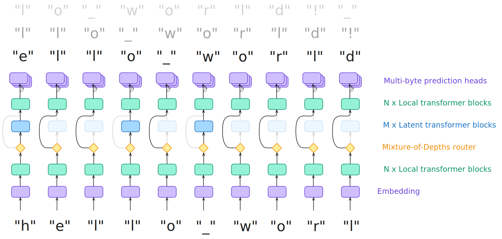

# 🤏Pico

Pico is my experimental language model decoder-only architecture designed to bypass tokenization by processing raw bytes directly.



To offset the computational cost of working at the byte level, the model employs sliding window attention over a small context.
To reintroduce longer-range dependencies, intermediate transformer blocks operate on larger windows, but they are selectively applied over a small fixed fraction of the bytes using a [Mixture-of-Depths](https://arxiv.org/abs/2404.02258) router.

This architecture share similarities with [SpaceByte](https://github.com/kjslag/spacebyte), but instead of applying intermediate transformer blocks when encountering whitespaces, Pico learns by itself when to insert them in an end-to-end manner.

I also experimented with [multi-byte prediction](https://arxiv.org/abs/2404.19737), which allows the model to not only predict the next byte but also the next few bytes.
This has been shown to improve the performance of byte-level models, although probably not at the scale I run my experiments but it also allows for *self-speculative decoding* at inference time.

Other architectural choices include:
- Sliding window, grouped-query attention
- SwiGLU
- [ALiBi positional encoding](https://arxiv.org/abs/2108.12409) (might try RoPE later)
- [SOAP optimizer](https://arxiv.org/abs/2409.11321) for pretraining

Here is an example of the output of a ~10M parameters Pico model trained on the [TinyStories](https://huggingface.co/datasets/roneneldan/TinyStories) dataset:

```
Once_ upon_ a t_ime,_ there_ _was a l_ittle_ g_irl_ named_ Lily._ She_ loved_ to_ play_ outs_ide_ _in_ the_ park._ One_ day,_ she_ sa_w_ a _bee_ fly_ing_ around_ her_ and sa_id,_ _"Hello,_ _bee!_ Do_ you_ _want_ to_ play_ _w_ith_ me?_"

_The_ _bee_ nodded_ and sa_id,_ _"Yes,_ I_ _would_ love_ to_ jo_in_ me,_ too!_"
```

The `_` prefixes the bytes where the model decided to insert the intermediate transformer blocks.
As we can see, the model has somehow chosen to insert them at word boundaries like a form of "tokenization".

When completly disabling the intermediate transformer blocks, the model can still generate well-formed words, but loose coherence at the sentence level:

```
Once upon a time in the wet borided in the safe in all the wonderful and thought again. He smilly came of the brave enough to listen that missides! He said whines waved as she funny thanks the weak down that is all the bricycle.
```

This suggests that the intermediate blocks may produces "higher-level" representations that helps the model to maintain coherence over longer ranges.

That being said, I also observed harder-to-interpret patterns on models trained on other datasets, so it's not clear that the Mixture-of-Depths is systematically used by the model as a form of tokenization.

## Usage

```bash
# Installation
uv sync

# Initialize a new model
python picolm.py init models/my-model --dim 372 --latent-num-blocks 8 --fb-att-window-size 32

# Train the model
python picolm.py train models/my-model my-train-run roneneldan/TinyStories --dataset-column-name text --batch-size 8

# Generate text
python picolm.py run models/my-model my-train-run --temperature 0.8 --prompt "Once upon a time"
```